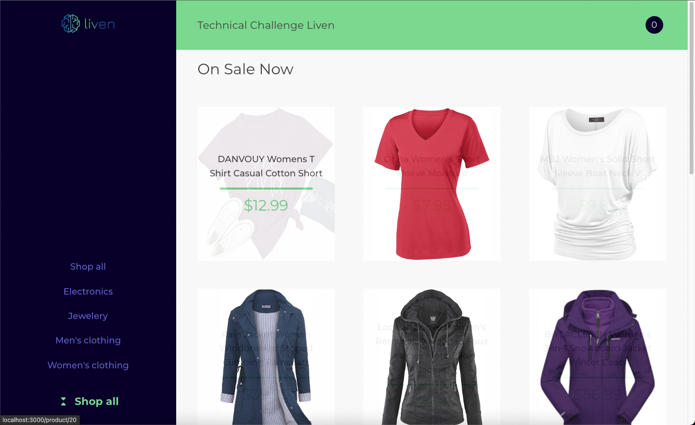
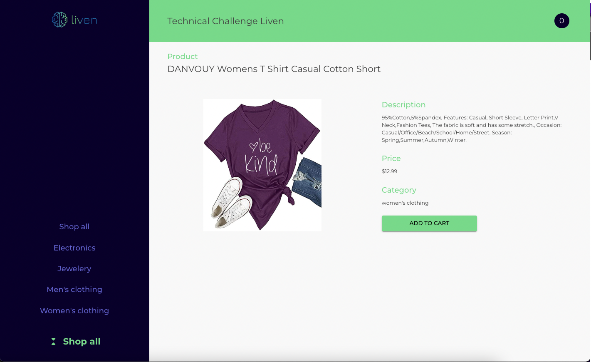
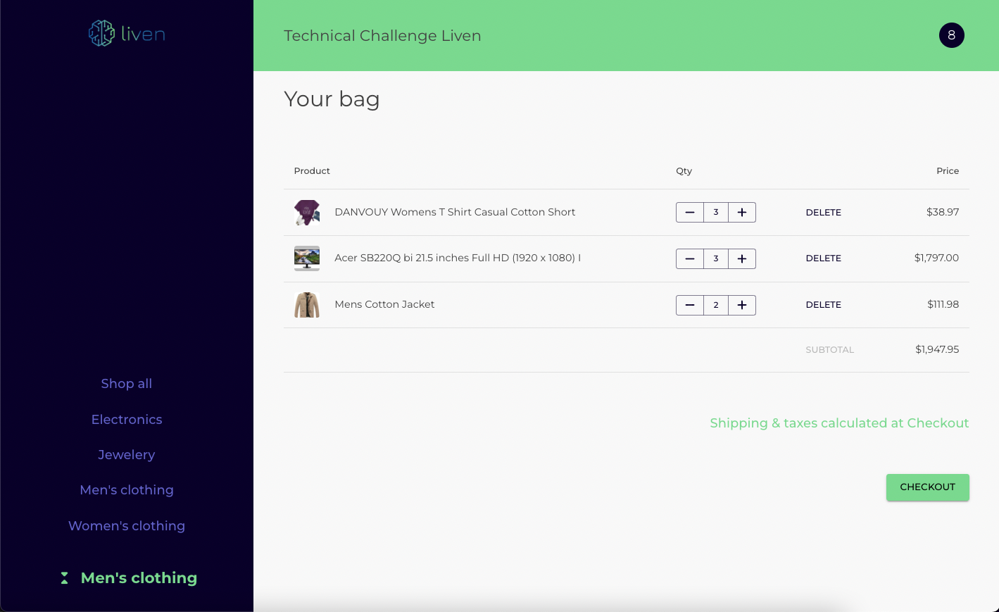
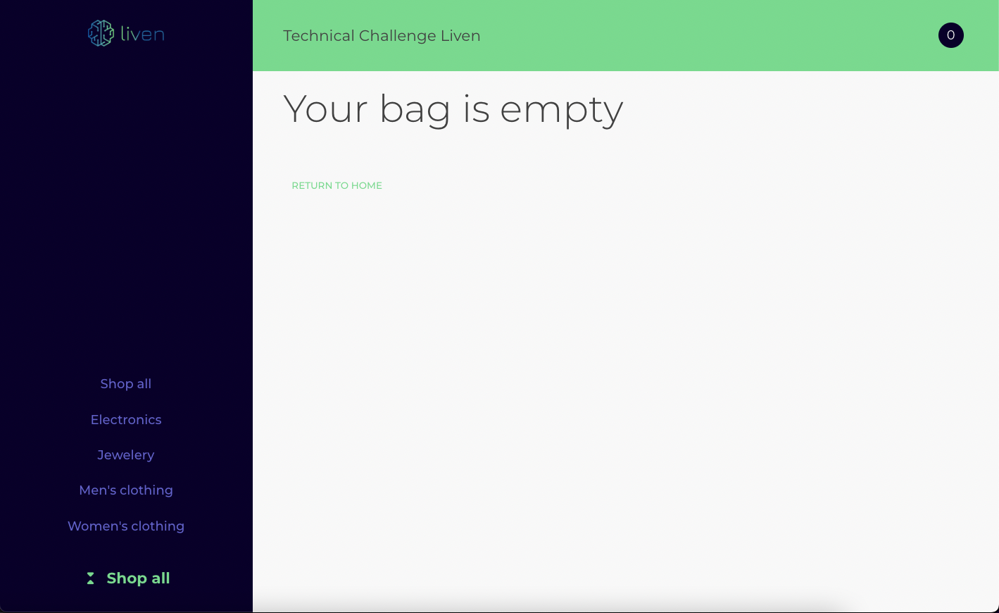

# ✅ Liven - Projeto de avaliação técnica Frontend

## Enunciado

Desenvolver um loja simples em React (pode ser Next.js) ou React Native utilizando **Typescript**, com um catálogo de produtos e um carrinho de compras. O usuário deve poder adicionar/remover produtos do catálogo no carrinho de compras.

## Especificações

### Tela de produtos 🎁

Será responsável por apresentar todos os produtos disponíveis para o usuário em uma lista. Será necessário que você estabeleça comunicação com o back-end, para obter informações relativas a cada uma dos produtos.

<aside>

🛰️ **Documentação da API:** Para este projeto, vamos utilizar o Fake Store API. A documentação está presente em [https://fakestoreapi.com/docs#products](https://fakestoreapi.com/docs#products)

</aside>

### Tela do carrinho de compras 🛒

Responsável por guardar os itens e quantidades adicionadas pelo usuário. É desejável que o usuário possa aumentar ou diminuir a quantidade de um produto do carrinho, além de remover por completo.

### Testes automatizados ✅

- Criação de suite de testes automatizados para o repositório.

## Sobre a entrega

1. **Estimativa de tempo para entrega**: O primeiro ponto de entrega deste projeto é o próprio tempo de estimativa para a entrega final do projeto.
2. **Cópia do repositório**: O repositório será entregue para avaliação da estrutura do projeto. Por isso, quaisquer pontos de documentação/comentários em código são bem vindos.

## Dicas sobre a nossa avaliação

Este projeto tem como objetivo nos permitir avaliar a sua capacidade técnica atual no uso algumas das diversas ferramentas de desenvolvimento que utilizamos no dia-a-dia. Sendo assim, nossa avaliação **não se limitará ao “funciona” vs “não funciona”.** Isso é positivo pois permite que você nos mostre tudo o que sabe no que diz respeito às boas práticas de desenvolvimento, além da implementação de um app que que “apenas funciona”. Alguns pontos que podemos julgar relevantes:

- **Organização do repositório GIT**. O uso do GIT é muito importante no dia-a-dia de desenvolvimento colaborativo, então a divisão dos commits, por exemplo, é algo que será avaliado
- **Arquitetura escolhida**. As decisões tomadas em relação à organização da aplicação, principalmente no que diz respeito ao gerenciamento de estado da mesma, serão avaliadas pensando em manutenibilidade, performance, etc...
- **Código limpo**. Todas as boas práticas que estão contidas aqui serão valorizadas (nomes de variáveis, tamanho das funções / classes, testes automatizados, etc...)

<aside>
⛔ Lembrando que o projeto tem como objetivo avaliar a **sua** capacidade técnica atual. Desta forma, é importante que você realize a implementação do projeto por conta própria, sem o uso de templates prontos da internet. (Não tem problema utilizar igniters como **create-next-app** ou **create-react-app**)

</aside>

**Boa sorte! 🍀**

---

## Link para o site

[liven.guilhermeddc.com.br](https://liven.guilhermeddc.com.br/)

---

# Telas

Ao entrar na aplicação ira para a tela inicial.



Ao clicar em um produto ira para a tela de produto.



Ao clicar em um em **ADD TO CART** adicionará o produto ao carrinho, e se clicar mais de uma vez ele aumentará a quantidade do mesmo e ao clicar no botão onde tem a quantidade ira para a tela do carrinho.



Ao clicar no botão de delete até não existir mais nenhum produto ira para tela de carrinho vazio.



```
  - Os dados se atualizam automaticamente ao voltar o focus para a página
  - Design responsivo
```

# Scripts:

### yarn

```
Instala dependências.
```

### yarn start

```
roda o projeto.
```

### yarn test

```
roda os testes.
```

# Stacks:

`react`

`typescript`

`material-ui`

`react-query`

`axios`

`react-testing-library`

# Arquitetura:

Criei o projeto através do create-react-app com o template do typescript. Dentro da pasta src foi onde alterei a arquitetura.

## Pages:

```
Armazena todas as telas do projeto com o seus componentes.
```

## Routes

```
Local onde é definida as rotas do projeto.
```

## Shared/Assets:

```
Local onde fica todas as imagens do projeto.
```

## Shared/Components:

```
Local onde fica todos os components que podem ser usado em qualquer lugar da aplicação.
```

## Shared/Context:

```
Local onde fica o contexto da aplicação.
```

## Shared/Hooks:

```
Local onde fica todos os hooks da aplicação.
```

## Shared/Services:

```
Local onde configurei a minha chamada da api e criei os arquivos onde será feita as chamadas.
```

## Shared/Layout:

```
Local onde armazenarei o layout base da aplicação.
```

## Shared/Theme:

```
Local onde armazenarei o tema padrão da aplicação.
```

## Shared/Utils:

```
Local onde armazenarei todas as funções que podem ser reaproveitadas no projeto.
```
